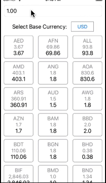

## Currency converter App.

The project is implemented by using Xcode 13.2.1, macOS 11.6.8. 
Project has also been tested and works well on Xcode 15, macOS Ventura

Project is built by using Swift and supports iOS 15.2 and above.

## Preview

App fetches exchange rates data from https://openexchangerates.org/api/latest.json

## Appflow

The required data is cached (saved) locally to permit the application to be used offline after data has been fetched from openexchangerates.org

In order to limit bandwidth usage, the required data is being refreshed from the API no more frequently than once every 30 minutes.

The user is able to select a base-currency from a list of currencies provided by open exchange rates.

User is able to enter the desired amount for the selected base currency.

Once user sets the base currency and enters desired amount in the textfield, App shows a list of converted currencies amounts. 
